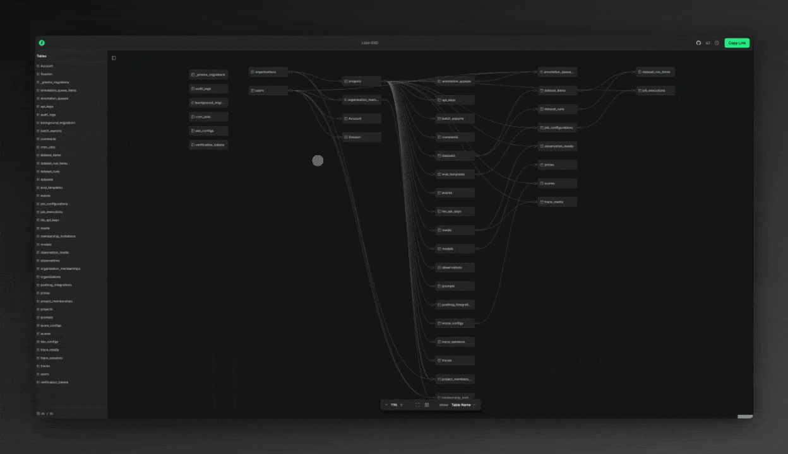

> **This is a fork.**
> The original work is [Liam ERD](https://github.com/liam-hq/liam) by ROUTE06, Inc.,
> licensed under the Apache License, Version 2.0. This fork is pinned to upstream
> commit `92156eac5` and does not track it.
>
> See [`NOTICE`](./NOTICE) for what was changed and [`LICENSE`](./LICENSE) for the
> license. Modified files carry a notice at the top of the file; files added by
> this fork are marked as such.
>
> The command-line tool is redistributed under a different name,
> [`crowfoot`](https://www.npmjs.com/package/crowfoot), because section 6 of the
> License grants no trademark rights. No endorsement by ROUTE06, Inc. is implied.
>
> Two usage sections follow: [the original Liam ERD](#using-liam-erd-upstream) and
> [this fork](#using-crowfoot-this-fork).

---

<h2 align="center">
  Automatically generates beautiful and easy-to-read ER diagrams from your database.
</h2>

<p align="center">
  Based on <a href="https://github.com/liam-hq/liam">Liam ERD</a> by ROUTE06, Inc., Apache-2.0.
</p>



<p align="center">
  <a href="https://liambx.com">Website</a> •
  <a href="https://liambx.com/docs">Documentation</a> •
  <a href="https://github.com/orgs/liam-hq/projects/1/views/1">Roadmap</a>
</p>

---

# Using Liam ERD (upstream)

The original tool, published as [`@liam-hq/cli`](https://www.npmjs.com/package/@liam-hq/cli)
and hosted at [liambx.com](https://liambx.com). Full documentation lives at
**<https://liambx.com/docs>**; this section is a summary of it.

## Public repositories — no install

Insert `liambx.com/erd/p/` into your schema file's URL:

```
# Original: https://github.com/user/repo/blob/master/db/schema.rb
# Modified: https://liambx.com/erd/p/github.com/user/repo/blob/master/db/schema.rb
                  👾^^^^^^^^^^^^^^^^👾
```

Example: <https://liambx.com/erd/p/github.com/docusealco/docuseal/blob/master/db/schema.rb>

## Private repositories — the CLI

Run the interactive setup, which walks you through picking a format and writes
the command you need:

```bash
npx @liam-hq/cli init
```

Or build directly:

```bash
npx @liam-hq/cli erd build --input db/schema.rb --format schemarb --output-dir dist
npx serve dist/
```

The output is a static Vite app. It **cannot** be opened over `file://` — serve
the directory over HTTP.

### `erd build` options

| Option | Description |
|---|---|
| `--input <path\|url>` | Schema file to read. Accepts a local path (glob patterns supported) or a URL. |
| `--format <format>` | Overrides format auto-detection. |
| `--output-dir <path>` | Output directory. Defaults to `dist`. |

A remote schema works the same way:

```bash
npx @liam-hq/cli erd build \
  --input https://raw.githubusercontent.com/user/repo/main/schema.sql \
  --format postgres
```

### Supported formats

| Source | `--format` | Typical files |
|---|---|---|
| PostgreSQL | `postgres` | `.sql` |
| Ruby on Rails | `schemarb` | `schema.rb`, `Schemafile` |
| Prisma | `prisma` | `schema.prisma` |
| Drizzle | `drizzle` | schema `.ts` files |
| tbls | `tbls` | `schema.json` |
| Liam JSON | `liam` | `schema.json` produced by Liam |

MySQL, SQLite and BigQuery have no direct parser. The documented workaround is to
export via [tbls](https://github.com/k1LoW/tbls) (or `pg_dump` to PostgreSQL) and
feed the result in. See [Supported Formats](https://liambx.com/docs/parser/supported-formats).

## UI features

- [Browsing your schema](https://liambx.com/docs/ui-features) — pan, zoom, filter and highlight.
- [Command palette](https://liambx.com/docs/ui-features) — `⌘K` to search tables with a live preview.
- [Sharing & query parameters](https://liambx.com/docs/ui-features) — almost every UI setting is reflected in the URL, so a link reproduces the view.

Reference documentation: [UI Features](https://liambx.com/docs/ui-features) ·
[Web](https://liambx.com/docs/web) · [CLI](https://liambx.com/docs/cli) ·
[Parser](https://liambx.com/docs/parser)

---

# Using crowfoot (this fork)

[`crowfoot`](https://www.npmjs.com/package/crowfoot) is the CLI of this fork. It builds
the same kind of standalone ERD app, plus persisted table positions, canvas memos,
colour coding, an explicit edit mode and MySQL export.

> Full reference: **[docs/usage.md](./docs/usage.md)** (한국어) ·
> **[docs/usage_en.md](./docs/usage_en.md)** (English) — every command and option,
> the sidecar file schemas, deployment and troubleshooting. The section below is a summary.

## Build and serve

```bash
npx crowfoot erd build --input schema.sql --format postgres --output-dir dist
npx serve dist/
```

Options are the same as upstream (`--input`, `--format`, `--output-dir`), and
`--format` accepts `postgres`, `schemarb`, `prisma`, `drizzle`, `tbls`, `liam`.
The interactive setup is `npx crowfoot init`.

As upstream, the output is a static SPA: `file://` will not work, serve it over HTTP.
All asset paths are relative, so the build can be mounted at a sub-path
(`/erd/`, say) without rebuilding.

## What this fork adds

| | |
|---|---|
| **Persisted table positions** | Dragged tables stay put across reloads. Resolution order is `?positions=` → browser storage → `layout.json` → automatic layout. Tables not pinned anywhere still get the automatic layout, so adding a table to the schema does not break an existing arrangement. |
| **Canvas memos** | Free-form notes pinned to the diagram. In edit mode, `Ctrl`/`Cmd` + right-click the canvas to add one; memos can be moved, resized, recoloured, duplicated, copy-pasted (including into another tab) and have their font size changed. Shipped with the build in `memos.json`. |
| **Multi-select** | In edit mode, drag a box across the canvas or `Ctrl`/`Cmd`/`Shift` + click to select several tables and memos at once, then move, tint or delete them together. |
| **Table grouping** | Gather tables into named groups, drawn as a dashed tinted box behind them. A table may belong to more than one group. Dragging a group's label moves its members together. One toolbar control switches between **group view** (boxes drawn, sidebar sectioned by group) and **single view** (no boxes, the plain alphabetical list). Shipped with the build in `groups.json`. |
| **Colour coding** | Tables and memos can be tinted from a fixed 12-colour palette taken from the existing design tokens: `green`, `mint`, `teal`, `sky`, `blue`, `steel`, `sand`, `yellow`, `gold`, `orange`, `vermilion`, `red`. |
| **Read-only by default** | Positions, memos and colours are locked unless the page is opened with `?edit=1`, so a shared link cannot be rearranged by accident. |
| **MySQL export** | Upstream exports PostgreSQL and YAML only; MySQL DDL was added, and the export menu can copy to the clipboard or download a `.sql` file. |
| **Short `?show=` values** | `all` / `table` / `key` instead of the internal `ALL_FIELDS` / `TABLE_NAME` / `KEY_ONLY`. |

## Edit mode

```
https://your-host/erd/?edit=1
```

`?edit=1` (or `?edit=true`) is what unlocks dragging tables, adding and editing
memos, and the colour menus. It is derived from the URL and never stored, so
closing the tab or dropping the parameter returns the diagram to read-only.

## Committing an arranged layout

The arrangement you make in edit mode lives in the URL, which makes it shareable
but not permanent. To turn a link into the sidecar files the viewer loads on every
visit, copy the URL and run:

```bash
npx crowfoot erd from-link --input '<the ?edit=1 URL>' --output-dir dist
```

Quote the URL — it contains `&`. Only the files the link actually carries are
written, so a link with no memos will not blow away an existing `memos.json`.

`layout.json`, `memos.json` and `groups.json` are loaded from the same directory
as `schema.json`, so keep them next to it and commit them to whatever your deploy
copies in — a rebuild overwrites the directory otherwise.

| File | Contents | Missing means |
|---|---|---|
| `schema.json` | The parsed schema. Written by `erd build`. | Nothing renders. |
| `layout.json` | `{"table_name": {"x": 0, "y": 0, "color": "teal"}}` | Automatic layout for every table. |
| `memos.json` | The canvas memos. | No memos. |
| `groups.json` | `[{"id": "...", "name": "Payment", "tableNames": ["orders"], "color": "gold"}]` | No groups. |

A table name may appear in more than one `groups.json` entry; both boxes are
drawn, and the sidebar lists that table once per group it belongs to.

In edit mode the Export menu also offers **Download layout.json**,
**Download memos.json** and **Download groups.json**, which is the same output
without going through a URL. The browser console exposes `crowfootLayout.dump()` /
`crowfootLayout.reset()`, `crowfootMemos.dump()` / `crowfootMemos.reset()` and
`crowfootGroups.dump()` / `crowfootGroups.reset()` for the same purpose.

Browser storage lives under `crowfoot:tableLayout`, `crowfoot:memos` and
`crowfoot:groups`. These were `liam:*` up to 0.4.0 and `erdkit:*` after that; a
value left under either old name is moved to the current one on the first read,
so nothing has to be rearranged.

## Query parameters

| Parameter | Values | Description |
|---|---|---|
| `show` | `all` \| `table` \| `key` | Level of detail. Defaults to `all`. |
| `active` | table name | Opens that table's detail panel. |
| `hidden` | compressed list | Table names hidden from the diagram. |
| `positions` | compressed `name:x:y` list | Table positions. Wins over `layout.json`. |
| `colors` | compressed `name:colorkey` list | Table tints. |
| `memos` | compressed JSON | The memos, verbatim. |
| `groups` | compressed JSON | The groups, verbatim. Wins over `groups.json`. |
| `showgroups` | `on` \| `off` | View mode. `on` (the default) draws the group boxes and sections the sidebar; `off` hides the boxes and returns the sidebar to a plain alphabetical list. Group data is untouched either way. |
| `edit` | `1` \| `true` | Enables editing. Absent means read-only. |

`positions`, `colors`, `memos` and `groups` are deflate-compressed and URL-safe
base64 encoded, so they survive CDN query-string handling intact. `memos` and
`groups` go in as one JSON blob rather than a list, because free-form text would
be shredded by the list parser's `,` split. Navigation parameters (`active`,
`show`, `hidden`, `showgroups`) push history entries; editing parameters
(`positions`, `colors`, `memos`, `groups`) replace them, so the back button
still does what you expect.

## Export menu

| Item | Output |
|---|---|
| Copy MySQL | MySQL DDL to the clipboard |
| Download MySQL (.sql) | `schema.mysql.sql` |
| Copy PostgreSQL | PostgreSQL DDL to the clipboard |
| Copy YAML | Schema as YAML |
| Download layout.json | Current positions and colours *(edit mode only)* |
| Download memos.json | Current memos *(edit mode only)* |
| Download groups.json | Current groups *(edit mode only)* |

## Keyboard shortcuts

| Keys | Action |
|---|---|
| `⌘K` / `Ctrl+K` | Command palette |
| `⌘C` / `Ctrl+C` | Copy the selected memos *(edit mode only)* |
| `⌘V` / `Ctrl+V` | Paste them at the cursor *(edit mode only)* |
| `⇧1` | Zoom to fit |
| `⇧2` | Show all fields |
| `⇧3` | Show table names only |
| `⇧4` | Show keys only |
| `⇧T` | Tidy up — re-run the automatic layout |
| `⇧A` | Show all tables |
| `⇧H` | Hide all tables |

## Development

```bash
pnpm install
pnpm dev                       # all dev servers
pnpm build                     # all packages
pnpm lint                      # lint and format
pnpm test                      # tests
```

Working on the CLI and viewer specifically:

```bash
cd frontend/packages/cli
pnpm run build                 # executable at dist-cli/bin/cli.js
pnpm run test
pnpm dev                       # builds the CLI against fixtures/ and serves the viewer
node ./dist-cli/bin/cli.js erd build --input ./fixtures/input.schema.rb --format schemarb
```

The fork's work surface is three packages: `frontend/packages/erd-core` (the
viewer), `frontend/packages/schema` (parsers and deparsers) and
`frontend/packages/cli` (the `crowfoot` command). See [`CLAUDE.md`](./CLAUDE.md)
for the monorepo layout and conventions.

---

## Documentation

- **[docs/usage.md](./docs/usage.md)** — crowfoot 사용 가이드 (한국어)
- **[docs/usage_en.md](./docs/usage_en.md)** — crowfoot usage guide (English)
- [liambx.com/docs](https://liambx.com/docs) — upstream Liam ERD documentation

What this fork changes is listed in [`NOTICE`](./NOTICE) and documented under `_docs/`.

## Roadmap

Upstream's roadmap is on [their project board](https://github.com/orgs/liam-hq/projects/1/views/1).
This fork is pinned to `92156eac5` and does not track upstream.

## Contributing

Refer to our [Code of Conduct for contributors](./CODE_OF_CONDUCT.md).

## Contributors

<a href="https://github.com/liam-hq/liam/graphs/contributors">
  
</a>

## Star History

<a href="https://www.star-history.com/#liam-hq/liam&Date">
 <picture>
   <source media="(prefers-color-scheme: dark)" srcset="https://api.star-history.com/svg?repos=liam-hq/liam&type=Date&theme=dark" />
   <source media="(prefers-color-scheme: light)" srcset="https://api.star-history.com/svg?repos=liam-hq/liam&type=Date" />
   
 </picture>
</a>

## License

Liam ERD is licensed under the [Apache License Version 2.0](LICENSE).

Licenses for third-party packages can be found in [docs/packages-license.md](docs/packages-license.md).
